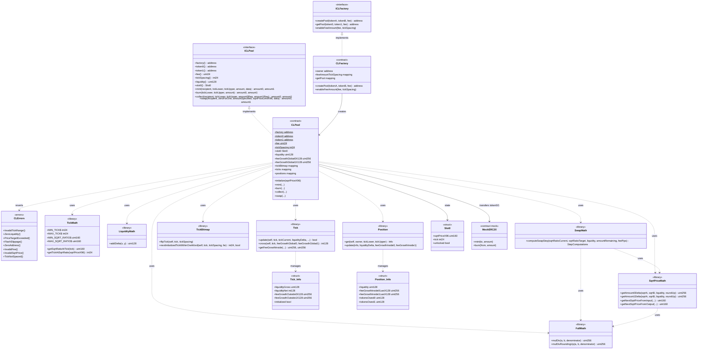

# Diagrama de clases — AMM v3 Concentrated Liquidity

Vista estructural de contratos, librerías e interfaces (módulo 14, **diseño v1**).

## Diagrama (Mermaid)

## Relaciones clave

| Relación | Motivo |
|----------|--------|
| `CLFactory` → `CLPool` | Un pool por `(token0, token1, fee)` |
| `CLPool` → libs de math | Precio Q64.96, amounts y steps de swap |
| `CLPool` → `TickBitmap` / `Tick` | Inicialización y cruce de ticks |
| `CLPool` → `Position` | Liquidez y fees por `(owner, range)` |
| `SwapMath` → `SqrtPriceMath` | Un step consume/produce tokens hasta target |

## Decisiones de diseño (v1)

- Sin NFT Position Manager: posiciones indexadas por `(owner, tickLower, tickUpper)`.
- Fee tiers con `tickSpacing` fijo vía factory (`enableFeeAmount`).
- `slot0` empaqueta `sqrtPriceX96`, `tick` y lock (`unlocked`) estilo Uniswap v3.
- Flash swaps completos fuera de alcance; se reserva `FlashSlippage` por compatibilidad de errores del módulo.
- TWAP / observations: post-v1.
