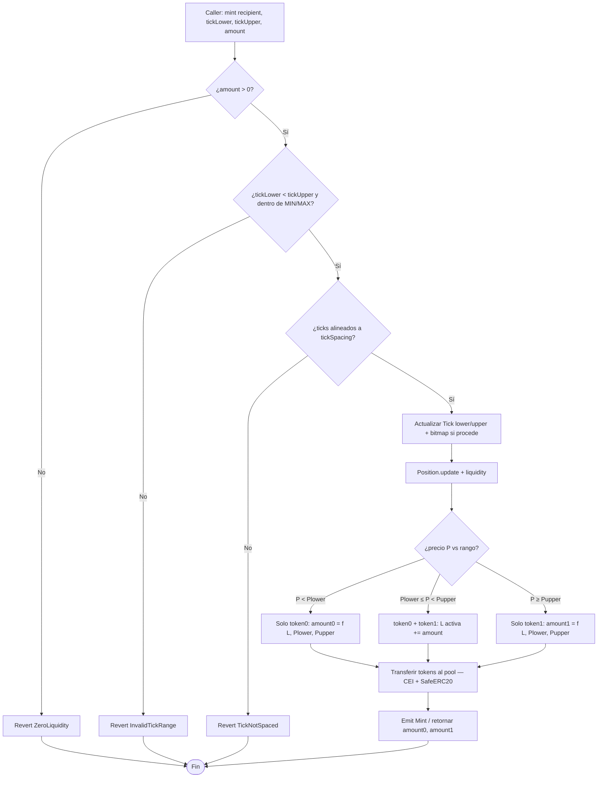
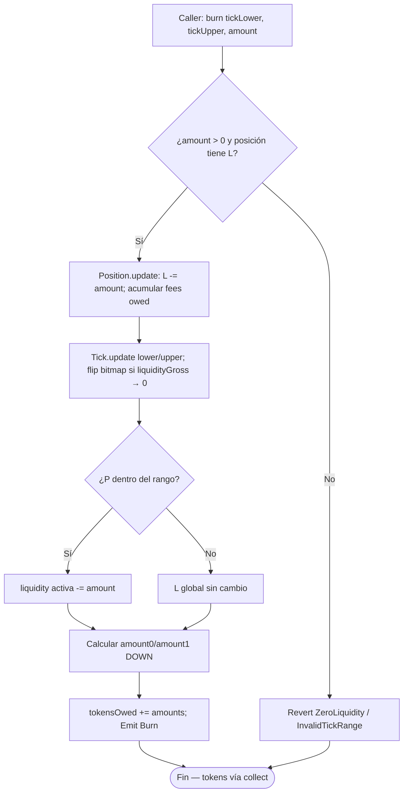
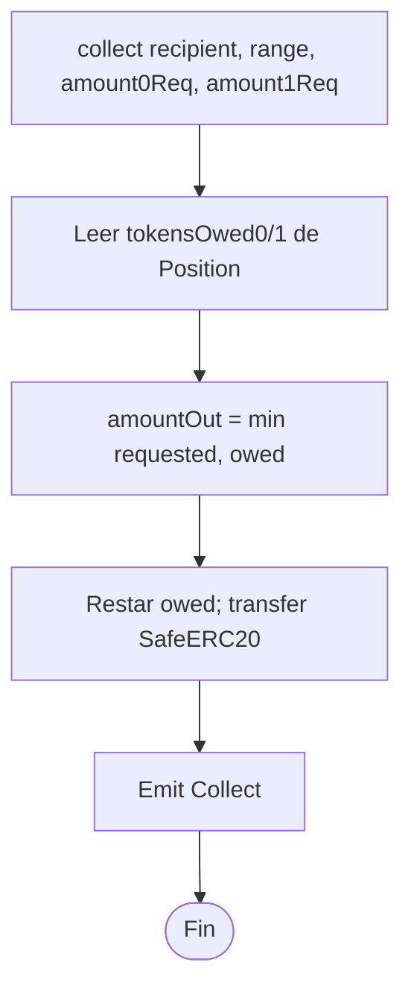
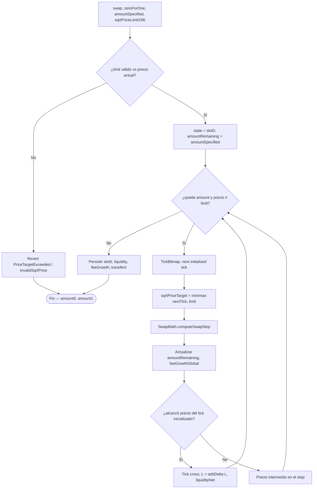
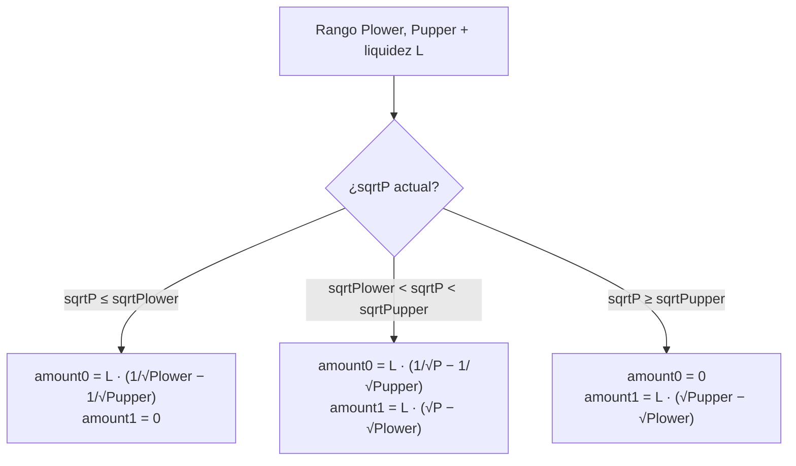
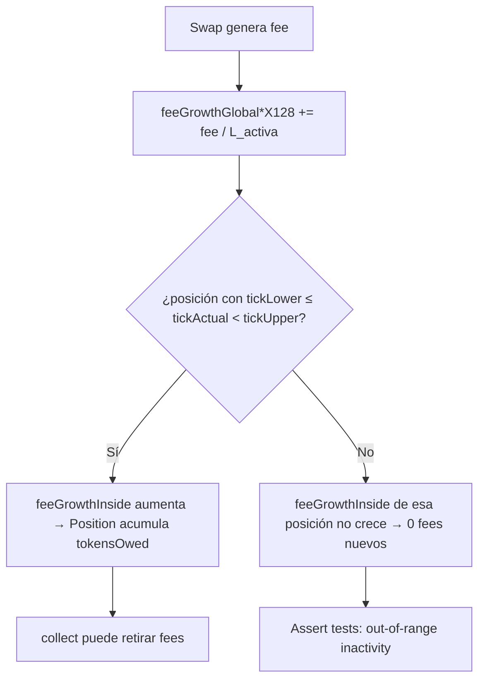
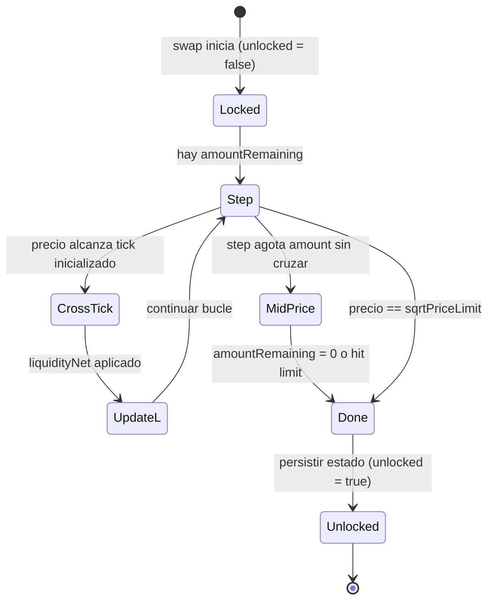
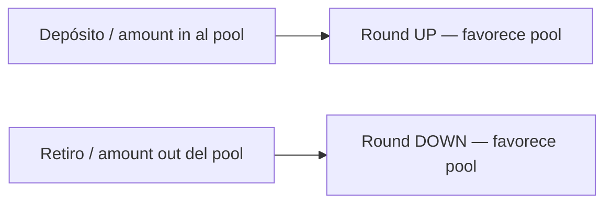

# Diagrama de flujo — Mint, Burn, Swap y Fees (CL AMM v3)

Flujos de decisión internos del pool de liquidez concentrada (módulo 14, **diseño v1**).

## 1. Mint — aportar liquidez en rango

> Redondeo: amounts calculados **UP** (favorece al pool).

## 2. Burn — retirar liquidez

## 3. Collect — cobrar tokens / fees owed

## 4. Swap — bucle multi-tick

## 5. Cálculo de amounts según ubicación de P

## 6. Fee growth — posición activa vs out-of-range

## 7. Ciclo de estados — slot0 durante un swap

## 8. Regla transversal — redondeo

