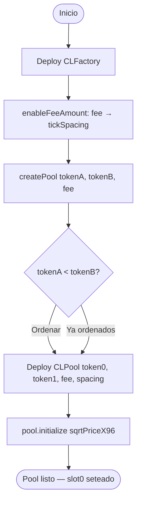
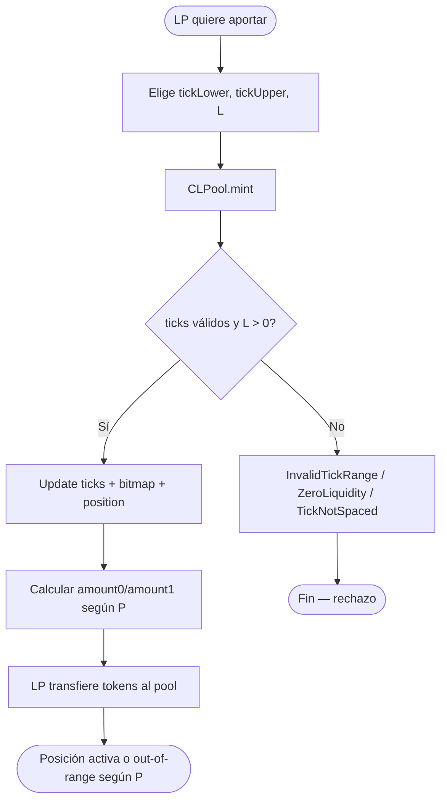
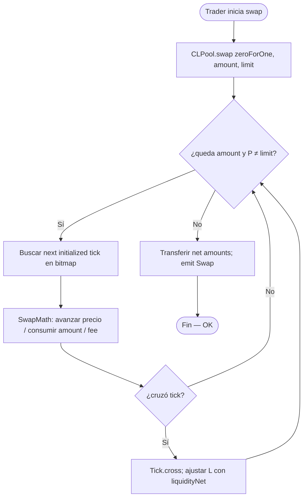
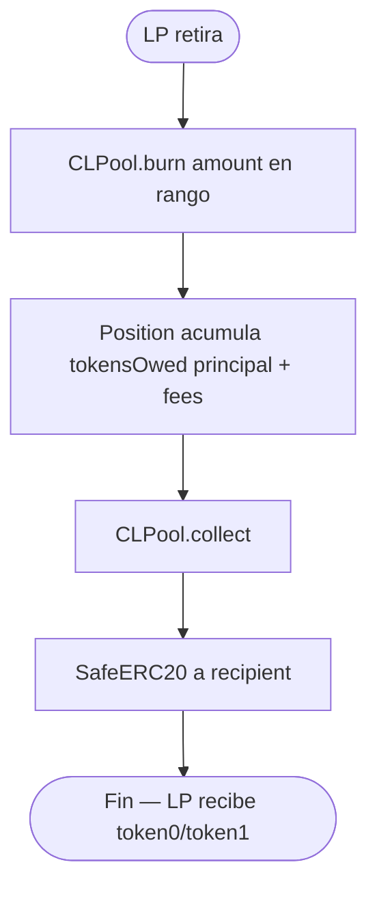
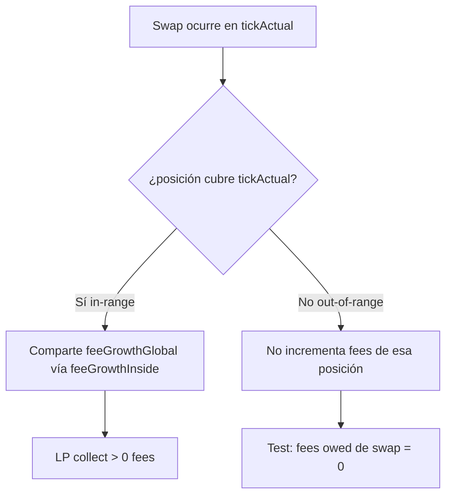
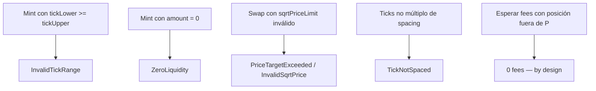
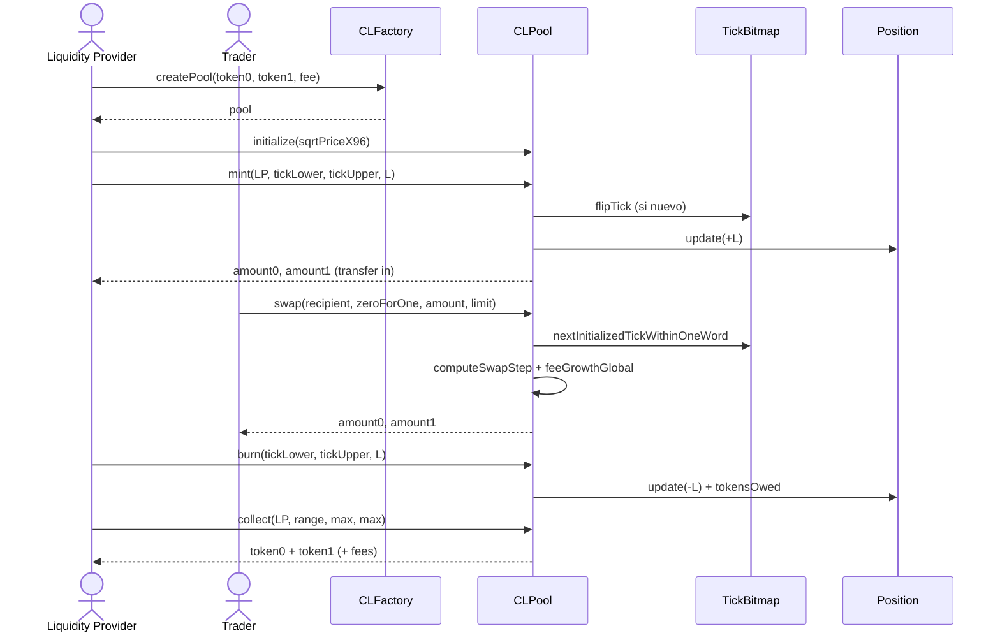
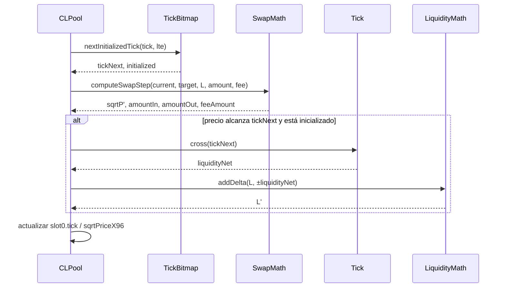

# Flujograma — Ciclo completo AMM v3 Concentrated Liquidity

Flujo extremo a extremo entre actores y contratos (módulo 14, **diseño v1**): factory, mint, swap multi-tick, burn/collect y testing.

## Actores

| Actor | Rol |
|-------|-----|
| Liquidity Provider (LP) | Aporta liquidez en un rango de ticks; cobra fees |
| Trader / Swapper | Intercambia token0 ↔ token1 contra el pool |
| CLFactory | Crea e indexa pools por par + fee |
| CLPool | Custodia tokens, ticks, posiciones y ejecuta swaps |
| TickBitmap / Tick / Position | Estructuras internas de liquidez y fees |
| CI / Foundry | Unit, fuzz, gas, out-of-range |

---

## Flujograma principal — Deploy + createPool

---

## Flujograma principal — Provisión de liquidez (mint)

---

## Flujograma principal — Swap multi-tick

---

## Flujograma principal — Burn + collect fees

---

## Flujograma — Fees in-range vs out-of-range

---

## Flujograma — Ataques / misuse típicos

---

## Secuencia — camino feliz mint + swap + collect

---

## Secuencia — un step de swap que cruza tick

---

## Gobernanza de implementación

```mermaid
flowchart LR
    Doc[doc/ ✅] --> F0[Fase 0 Setup ✅]
    F0 --> F1[Fase 1 FullMath/TickMath ✅]
    F1 --> F2[Fase 2 Sqrt/Liq/SwapMath ✅]
    F2 --> F3[Fase 3 Bitmap/Tick/Position ⏳]
    F3 --> F4[Fase 4 Mint/Burn/Collect]
    F4 --> F5[Fase 5 Swap multi-tick]
    F5 --> F6[Fase 6 Factory/e2e/fuzz]
    F6 --> F7[Fase 7 Gas/Deploy/SWC]
    F7 --> Done([Módulo v1])
```

**Gate:** no avanzar de fase sin *“autorizo Fase N”*. Detalle en [`planificacion.md`](./planificacion.md).  
**Estado:** Fases **0–2** ✅. Siguiente: **Fase 3**.
